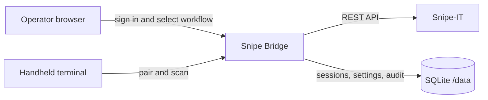

<p align="center">
  
</p>

<h1 align="center">Snipe Bridge</h1>

<p align="center">
  A secure bridge between Snipe-IT and legacy handheld barcode terminals.
</p>

<p align="center">
  <a href="LICENSE"></a>
  
  
  
</p>

<p align="center">
  <a href="README.pl.md">Polski</a> ·
  <a href="docs/installation.md">Installation</a> ·
  <a href="docs/configuration.md">Configuration</a> ·
  <a href="docs/user-guide.md">User guide</a> ·
  <a href="docs/troubleshooting.md">Troubleshooting</a>
</p>

Snipe Bridge lets modern operator browsers control asset checkout and return workflows performed on old barcode terminals, including Windows CE / Windows Mobile devices. The Snipe-IT API token stays on the server. A terminal receives only a compact, paired session and a deliberately simple 320 px interface.


## Why Snipe Bridge?

| Problem | Snipe Bridge approach |
|---|---|
| A legacy browser cannot render current Snipe-IT | Dedicated HTML/CSS compatible with narrow, old terminals |
| The terminal must not receive an API token | All Snipe-IT calls are made by the bridge server |
| Operators authenticate through company identity | OpenID Connect plus a local administrator fallback |
| A scanner may send a barcode, serial, custom tag, or asset URL | One lookup pipeline normalizes all supported forms |
| Checkout and return actions need traceability | Per-user audit history, admin-wide view, CSV and XLSX export |

## Features

- single-use QR pairing with a six-digit manual fallback;
- single and batch checkout and return;
- lookup by Asset Tag, serial number, configurable custom field, or any Snipe-IT `/hardware/<ID>` QR URL;
- Google Workspace, Microsoft Entra ID, Keycloak, Authentik, Okta, and other OpenID Connect providers;
- optional identity-domain restriction, administrator e-mails, and administrator groups;
- per-user activity history, administrator-wide audit view, filters, paging, CSV, and XLSX;
- administrator-managed Snipe-IT connection, status mappings, branding, language, and identity provider;
- Polish and English operator and terminal interfaces;
- SQLite persistence with WAL, maintenance, retention, and rotating backups;
- rate limiting, CSRF protection, operation locks, secure cookies, health, and readiness endpoints;
- Docker Compose, Portainer, and GitHub Actions support.

## How it works



The operator signs in, pairs a terminal, selects checkout or return, and—when checking out—chooses a recipient. The terminal then scans and confirms assets. It never authenticates directly to Snipe-IT.

## Quick start with Docker Compose

Requirements: Docker Engine with Compose v2 and a reachable Snipe-IT instance.

```bash
cp .env.example .env
```

Set at least these values in `.env`:

```env
SECRET_KEY=replace-with-a-long-random-value
ADMIN_USERNAME=admin
ADMIN_PASSWORD=replace-with-a-strong-password
SNIPEIT_BASE_URL=https://snipe.example.org
SNIPEIT_API_TOKEN=replace-with-a-dedicated-api-token
```

Start the application:

```bash
docker compose up -d --build
docker compose ps
```

Open `http://SERVER:8080/`, sign in, and finish the setup in **Settings**. Open `http://SERVER:8080/terminal` on the handheld device.

For a production deployment, put the operator panel behind HTTPS, set `SESSION_COOKIE_SECURE=true`, and keep the `/data` volume persistent and backed up.

## Compatibility

- server: Python 3.12 and Linux containers;
- Snipe-IT: REST API with hardware, users, status-label, checkout, and check-in permissions;
- operator: a current desktop browser;
- terminal: narrow legacy browsers, with a safe mode for particularly unstable engines;
- deployment: Docker Compose, Portainer, Synology Container Manager, or another Docker-compatible platform.

## Documentation

| Document | Audience |
|---|---|
| [Documentation index](docs/README.md) | Everyone |
| [Installation](docs/installation.md) | Administrators |
| [Configuration reference](docs/configuration.md) | Administrators |
| [Authentication and OIDC](docs/authentication.md) | Identity administrators |
| [Operator and terminal user guide](docs/user-guide.md) | Operators |
| [Instrukcja użytkownika (PL)](docs/user-guide-pl.md) | Operatorzy |
| [Administration and maintenance](docs/administration.md) | Administrators |
| [Troubleshooting](docs/troubleshooting.md) | Support and administrators |
| [Development](docs/development.md) | Contributors |

## Security

Use a dedicated, least-privilege Snipe-IT technical account. Never commit `.env`, database files, API tokens, client secrets, or production backups. The administrator settings page masks stored secrets and does not return the configured Snipe-IT API token to the browser.

Please report vulnerabilities privately as described in [SECURITY.md](SECURITY.md).

## Contributing

Issues and pull requests are welcome. Read [CONTRIBUTING.md](CONTRIBUTING.md) before changing the terminal frontend: compatibility with legacy browsers is a core project requirement.

## License

Snipe Bridge is available under the [MIT License](LICENSE).
