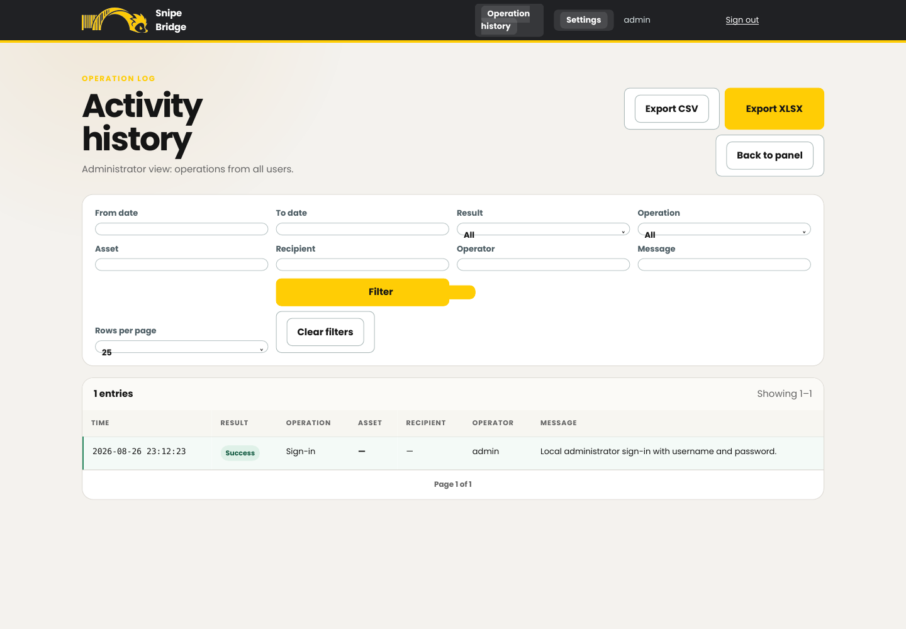

# Snipe Bridge documentation

This documentation is written for the generic open-source distribution. Replace example hostnames, identity-provider values, status names, and credentials with values from your environment.

## Start here

| Goal | Document |
|---|---|
| Install with Docker, Compose, Portainer, or Synology | [Installation](installation.md) |
| Configure every environment variable | [Configuration reference](configuration.md) |
| Configure Google, Entra ID, Keycloak, or another OIDC provider | [Authentication](authentication.md) |
| Learn the operator and terminal workflow | [User guide](user-guide.md) |
| Instrukcja dla operatorów po polsku | [Instrukcja użytkownika](user-guide-pl.md) |
| Manage settings, status mappings, audit data, and backups | [Administration](administration.md) |
| Diagnose deployment, pairing, scanning, and Snipe-IT errors | [Troubleshooting](troubleshooting.md) |
| Set up a development environment and contribute | [Development](development.md) |
| Publish the repository and container image | [GitHub publishing](publishing.md) |

## Supported workflow

1. An operator signs in through OpenID Connect or the local administrator account.
2. The handheld opens `/terminal` and scans the one-time pairing QR from the operator panel.
3. The operator selects checkout or return, single or batch mode, and—only for checkout—a Snipe-IT recipient.
4. The terminal scans assets and confirms the operation.
5. Snipe Bridge calls the Snipe-IT API and records an audit entry.

No Snipe-IT API token is sent to the terminal.

## Screenshots

The screenshots use a temporary database and demonstration values. They contain no production credentials or production asset data.

| Operator panel | Terminal pairing |
|---|---|
|  |  |

| Terminal confirmation | Activity history |
|---|---|
|  |  |

## Release

The package documents `1.0.0-rc14`. See the project [changelog](../CHANGELOG.md) for the complete release history.
