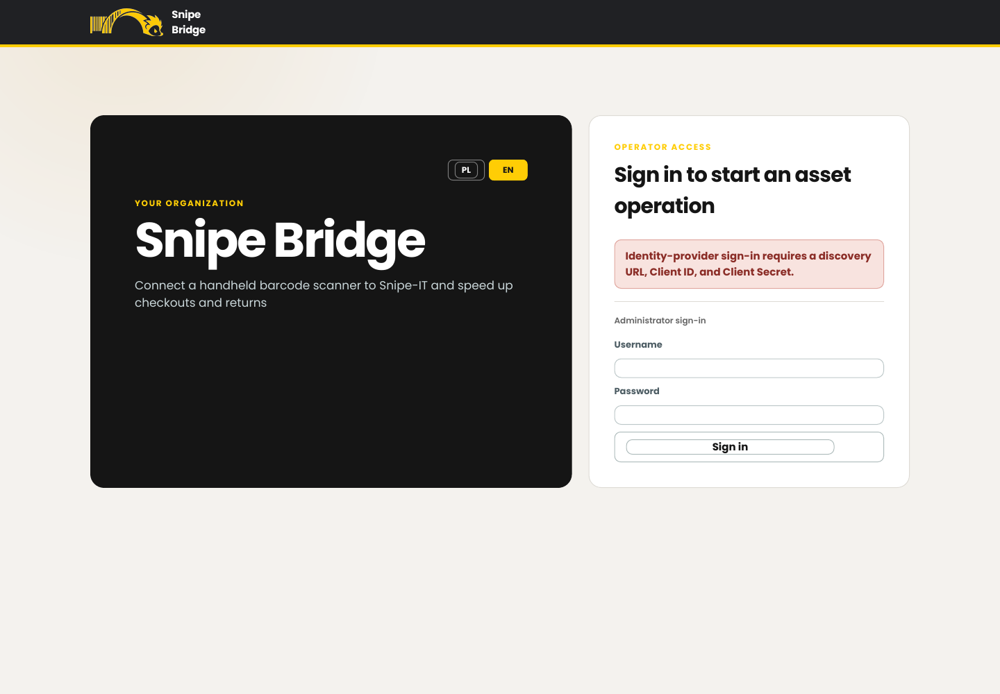
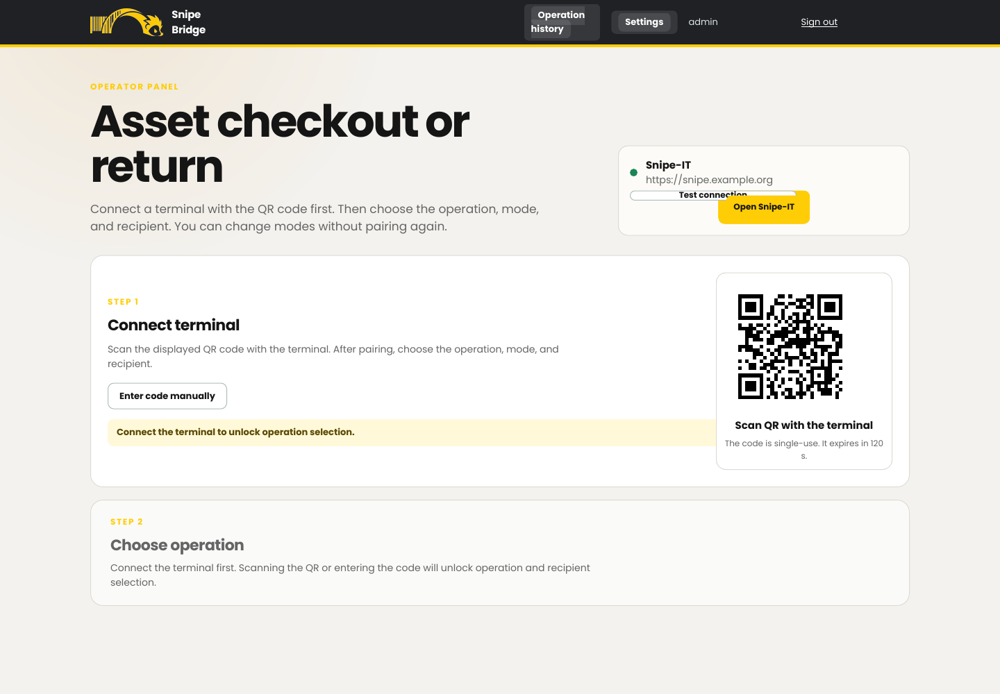
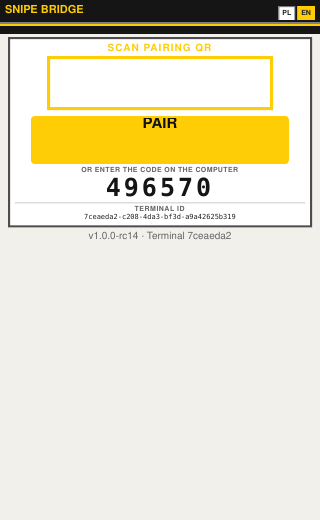
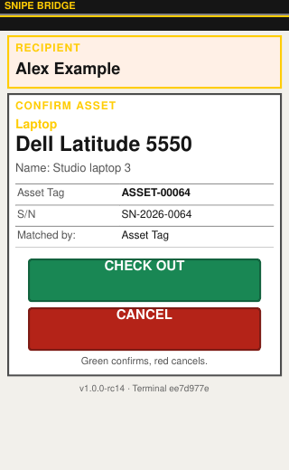

# Operator and terminal user guide

This guide is for day-to-day users. It does not require access to application settings or the Snipe-IT API token.

## Before you start

- Make sure the terminal is connected to the same reachable network as Snipe Bridge.
- Open the operator panel in a current browser.
- Open `/terminal` on the handheld scanner.
- Make sure barcode scanning is configured to append Enter.

## 1. Sign in

Open the operator URL and sign in with the configured identity provider. Use the local administrator form only if you are the administrator responsible for the installation.

The interface language follows your user session. Before pairing, the terminal language can be changed from its header.

## 2. Pair the terminal

The operator panel shows a single-use QR code in step 1.

On the terminal:

1. Keep the cursor in the pairing scan field.
2. Scan the QR shown on the operator computer.
3. If QR scanning is unavailable, open the manual option on the operator panel and enter the six-digit code displayed by the terminal.

The QR expires after a short time and can only be used once. Generate a new QR if it has expired. Pairing does not expose the Snipe-IT API token.

## 3. Choose an operation

After pairing, choose one of four workflows in step 2:

- **Checkout** — one asset at a time;
- **Batch checkout** — multiple assets, one final confirmation;
- **Return** — one asset at a time;
- **Batch return** — multiple assets, one final confirmation.

The selected screen is sent to the paired terminal automatically.

## 4. Checkout

In step 3, search for the recipient by name or e-mail and select the correct Snipe-IT user. Continue on the terminal:

1. Scan an Asset Tag, serial number, configured additional tag, or Snipe-IT asset QR.
2. Verify the category, manufacturer/model, optional asset name, Asset Tag, serial number, and recipient.
3. Press the green key or the green confirmation button.
4. Press the red key or cancel button if the item is wrong.

The configured checkout status is applied after a successful Snipe-IT checkout.

## 5. Return

Return does not require choosing a person. The current assignee is read from the scanned asset.

1. Select single or batch return in the operator panel.
2. Select the target status: ready for use or service required, when offered.
3. Scan the asset.
4. Verify the asset and current assignee.
5. Confirm with the green key/button.

The bridge refuses an invalid return when the asset is not assigned or does not meet the configured status/meta-status rules. If service is required, the selected service status is applied and the action note records that choice.

## 6. Batch operations

Scan each item once. A duplicate scan displays a warning and does not create a second list entry.

Before final confirmation:

- review the item count and every asset;
- use **Select for removal** on the relevant list entry when an item was added by mistake;
- verify the removal screen, then confirm with green or cancel with red;
- choose **Confirm list** only when the batch is complete.

A completed batch clears the terminal list. Success, warning/duplicate, and error results use green, yellow, and red feedback respectively.

## 7. Change mode without pairing again

Use the operator panel to select another workflow. The terminal should load the new screen automatically. Do not scan during the brief loading state. If the terminal remains on the previous workflow, wait for its refresh interval; only then use a manual refresh.

## 8. End the session

Use **End session** on the terminal or sign out of the operator panel. The pairing is removed and the operator panel shows a new QR code. Do not simply close the terminal browser if the device will be handed to another operator.

Inactive terminal sessions expire according to the administrator's configured idle timeout.

## Supported scan values

| Code content | Example |
|---|---|
| Asset Tag | `ASSET-00064` |
| Serial number | `SN-2026-0064` |
| Additional asset field | Organization-specific value |
| Snipe-IT asset URL | `https://snipe.example.org/hardware/64` |

For asset URLs, Snipe Bridge recognizes the `/hardware/<numeric ID>` path independently of the Snipe-IT hostname.

## When something goes wrong

- **No asset found:** check that the complete barcode was scanned and that the asset exists in Snipe-IT.
- **QR expired or already used:** generate and scan a new pairing QR.
- **Asset cannot be returned:** verify its assignment and status in Snipe-IT.
- **Wrong recipient:** cancel before confirming and choose the correct person in the operator panel.
- **Terminal does not change mode:** wait briefly, then refresh once. Report repeated failures to the administrator.
- **The terminal browser becomes unstable:** ask the administrator to enable terminal safe mode or disable asset images.

Every completed or rejected operation appears in your Activity history. Contact an administrator with the timestamp, Asset Tag, and displayed message when support is required.
